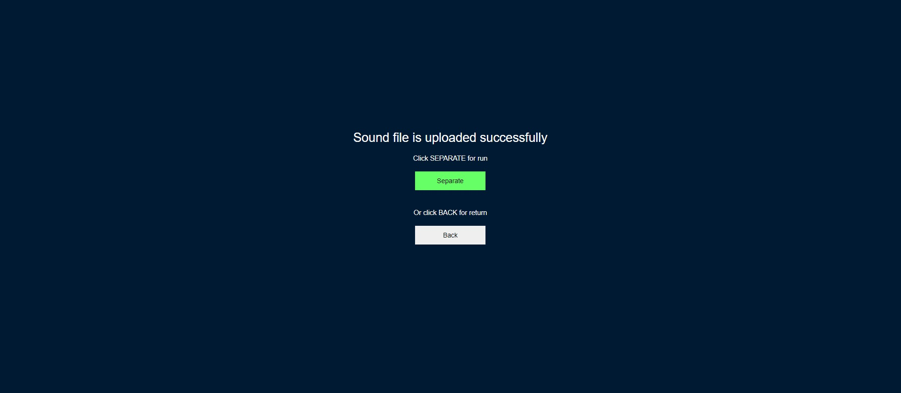
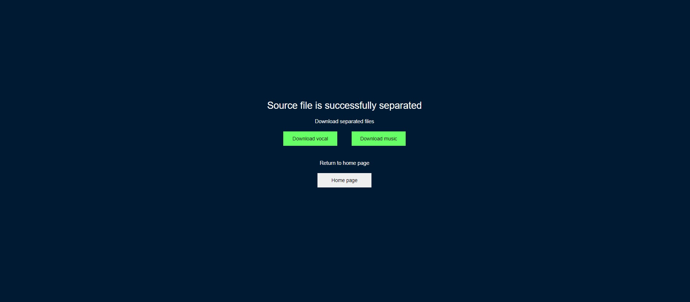

## Web приложение для разделения музыкального файла на составляющие

Веб приложение для онлайн разделения загруженного музыкального файла на два отдельных файла с вокалом и аккомпанементом.

Стартовое окно выглядит так

После загрузки исходного музыкального файла.

После отправки на сервер.

Скачивание разделенных файлов.

Приложение выполнено на простом сервере Python, разделение исходного файла выполняется с помощью открытой библиотеки Open-unmix.

Ссылка на авторов Open-unmix
@article{stoter19,  
  author={F.-R. St\\"oter and S. Uhlich and A. Liutkus and Y. Mitsufuji},  
  title={Open-Unmix - A Reference Implementation for Music Source Separation},  
  journal={Journal of Open Source Software},  
  year=2019,
  doi = {10.21105/joss.01667},
  url = {https://doi.org/10.21105/joss.01667}
}
